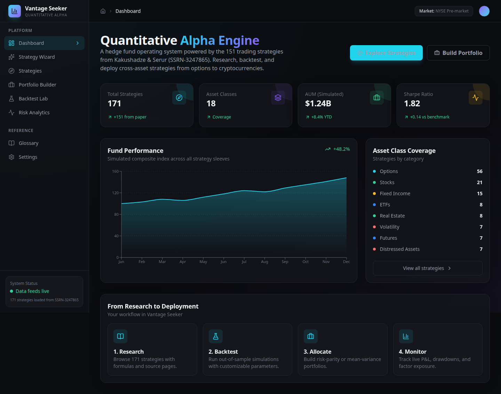
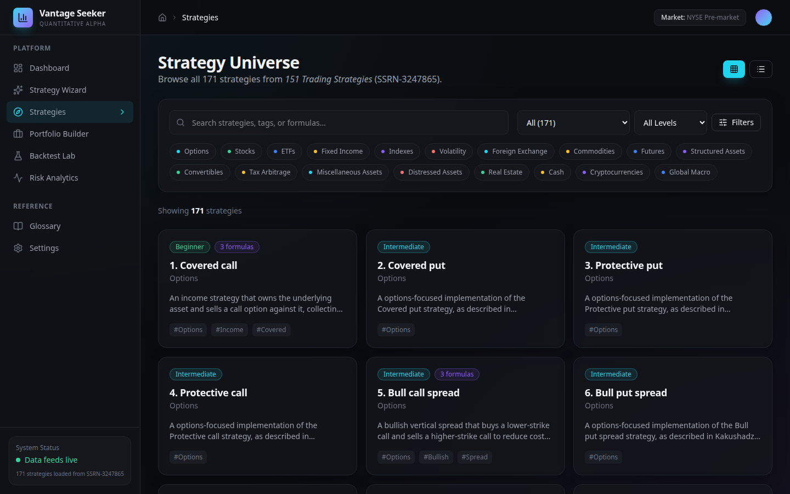
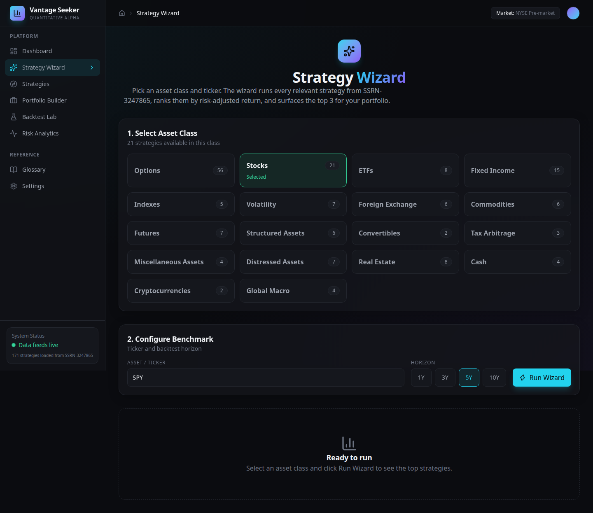
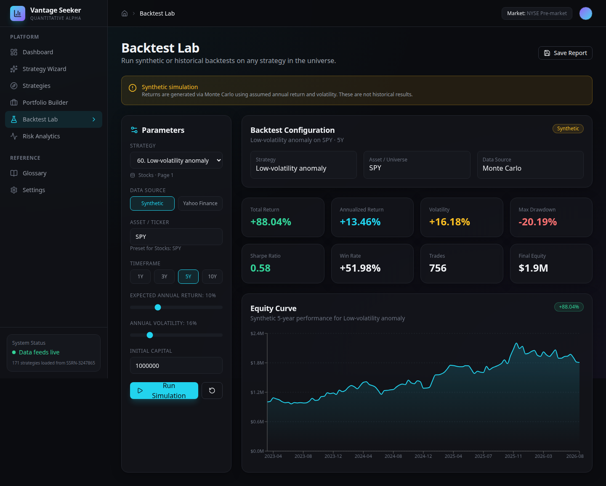
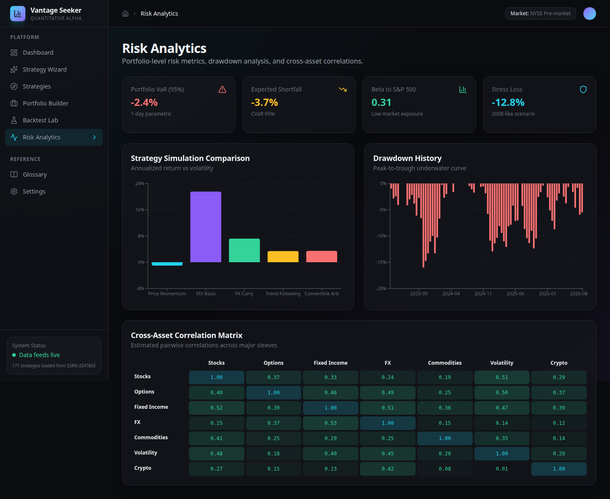

# Vantage Seeker · Strategy Research Workbench

> An interactive catalog and research frontend for the 151 trading strategies in Kakushadze & Serur's *151 Trading Strategies* (SSRN-3247865).

## Genesis

Vantage Seeker was born from a single question: *What would it look like if the compendium of strategies in [Kakushadze & Serur, "151 Trading Strategies" (SSRN-3247865)](https://ssrn.com/abstract=3247865) were available as a modern, interactive research platform?*

The paper is a 361-page encyclopedia of quantitative trading — spanning options, stocks, ETFs, fixed income, foreign exchange, commodities, volatility, structured assets, convertibles, real estate, distressed debt, cash, cryptocurrencies, and global macro. Each strategy includes mathematical formulations, implementation notes, and references. But it is, by design, a static academic reference.

Vantage Seeker turns that reference into a browsable, searchable workbench. It gives traders and researchers a way to explore the strategy universe, inspect formulas, run quick simulations, construct toy portfolios, and analyze risk — all inside a Vantage-inspired dark UI built for speed and clarity.

The name combines two ideas:

- **Vantage** — a point of view; the analytical perspective a quant needs.
- **Seeker** — the active search for alpha across a massive strategy space.

## Current scope & limitations

This is a **frontend research tool and strategy catalog**, not a production trading system. Before using it, please read [LIMITATIONS.md](./LIMITATIONS.md). In short:

- **No live market data** is connected by default.
- **Backtests are synthetic Monte Carlo simulations** unless you connect a data provider.
- **No live trading or order execution** is implemented.
- **No transaction costs, slippage, or market-impact modeling** is included.
- All numbers are illustrative; nothing here is investment advice.

## What it does

### Strategy Universe

Browse **171 cross-asset strategies** derived from SSRN-3247865. Filter by asset class, complexity, and tags. Each strategy card links to a detailed view with descriptions and LaTeX-rendered formulas.

### Strategy Wizard

Select an asset class and ticker, choose a horizon, and let the Wizard simulate every relevant strategy in that class. It ranks them by Sharpe ratio and surfaces the **top 3** candidates for further research.

### Portfolio Builder

Allocate capital across strategies with interactive sliders. Rebalance equal-weight, inspect simulated factor exposure, and view an allocation pie chart with risk/return summary.

### Backtest Lab

Run strategy-aware simulations. Selecting a strategy auto-loads realistic return/volatility presets by asset class. Adjust capital, timeframe, rebalance frequency, and assumptions. View equity curves and full metrics.

### Risk Analytics

Inspect portfolio-level risk metrics: VaR, CVaR, beta, stress loss, drawdown history, strategy comparison, and a cross-asset correlation matrix.

### API Connections

Manage data provider keys with service names, endpoints, Swagger/OpenAPI spec URLs, and connection status checks.

### Glossary

Reference key quant terms, acronyms, and notation from the paper.

## Screenshots

> All charts, metrics, and P&L figures below are **illustrative simulations** for demonstration purposes. They do not reflect live market data or guaranteed performance.

### Dashboard

The main overview shows the full strategy universe, simulated fund performance, and asset-class coverage at a glance.



### Strategy Universe

Browse, search, and filter all 171 strategies derived from SSRN-3247865.



### Strategy Wizard

Pick an asset class and ticker, then run every relevant strategy to surface the top 3 by risk-adjusted return.



### Backtest Lab

Run synthetic Monte Carlo simulations or fetch historical prices from Yahoo Finance to compare strategy overlays.



### Risk Analytics

Inspect portfolio-level VaR, drawdowns, strategy comparisons, and cross-asset correlations.



## Tech stack

- **Vite** + **React 19** + **TypeScript 6**
- **Tailwind CSS 4** for styling
- **Recharts** for data visualization
- **KaTeX** for math rendering
- **Framer Motion** for UI transitions
- **Lucide React** for icons

## Project structure

```
src/
  components/      Layout, navigation, and reusable UI primitives
  data/            strategies.ts — the full strategy universe from SSRN-3247865
  lib/             Utility helpers, backtest simulation, and data adapters
  pages/           Dashboard, Wizard, Strategies, Portfolio, Backtest, Analytics, Glossary, Settings
```

## Getting started

```bash
cd vantage-seeker
npm install
npm run dev
```

Then open `http://localhost:5173`.

## Build for production

```bash
npm run build
npm run preview
```

## Running tests

```bash
npm test
```

## Historical backtests

The Backtest Lab can fetch real price data from **Yahoo Finance**. Because Yahoo does not send CORS headers, browser requests may be blocked unless you route them through a CORS proxy. You can configure a proxy URL directly in the Backtest Lab UI (e.g. `https://corsproxy.io/?`).

Historical backtests currently apply simple strategy overlays (momentum, mean-reversion, or buy-and-hold) and do not include dividends, fees, slippage, or borrow costs. See [LIMITATIONS.md](./LIMITATIONS.md).

## Credits

Vantage Seeker would not exist without the foundational work of **Zura Kakushadze** and **Juan Andrés Serur**.

All strategy names, categories, descriptions, and selected mathematical formulas are derived from their encyclopedic work:

> **Zura Kakushadze and Juan Andrés Serur,** *"151 Trading Strategies,"* SSRN-3247865, 2018.  
> Available at: [https://ssrn.com/abstract=3247865](https://ssrn.com/abstract=3247865)

The original paper is a 361-page pedagogical reference covering over 150 trading strategies across a host of asset classes, complete with more than 550 mathematical formulas, source code for backtesting, bibliographic references, and a detailed glossary. Vantage Seeker is an independent interactive frontend built on top of that research.

### Citation

If you use Vantage Seeker in academic or commercial work, please cite the original source:

```bibtex
@article{kakushadze2018151,
  title={151 Trading Strategies},
  author={Kakushadze, Zura and Serur, Juan Andr{\'e}s},
  journal={SSRN Electronic Journal},
  year={2018},
  publisher={Elsevier}
}
```

## Disclaimer

This application is a pedagogical frontend; it does not provide investment advice.

## Roadmap

- [x] Interactive strategy catalog with formulas
- [x] Synthetic simulation backtests
- [x] Strategy Wizard ranking
- [x] Portfolio builder
- [x] Risk analytics
- [x] Historical price backtests via Yahoo Finance
- [ ] Transaction-cost and slippage modeling
- [ ] Strategy parameter optimization
- [ ] Exportable research reports
- [ ] Multi-account portfolio tracking

## License

See [LICENSE](./LICENSE).
